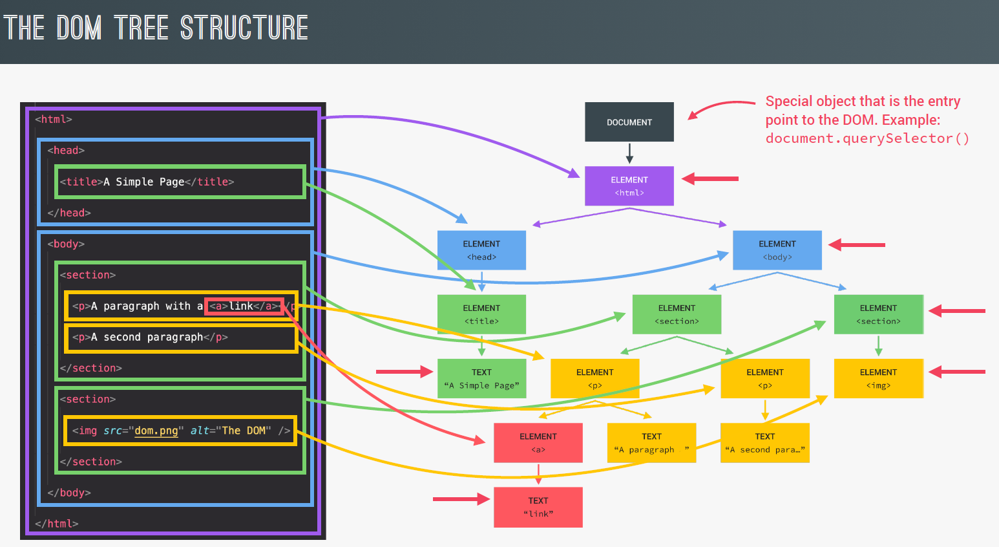

# DOM (Document object Model)

- When a browser loads a web page, it reads the HTML and turns it into a structured tree-like representation — this structure is the **DOM**.
- Key Points:\
   **"Document"** refers to the HTML page.\
   **"Object"** means everything (tags, text, attributes) is represented as a JavaScript object.\
   **"Model"** indicates it's a structured representation (like a tree or hierarchy).
- DOM represents the page so that programs can change the document structure, style, and content.
- Example -
  
- DOM methods and properties like `querySelector` are not part of Javascript; they are part of Web APIs.

# Key Takeaways

- We can attach an event listener to any element. For example -

  ```js
  document.querySelector(".check").addEventListener("click", function () {
    //Write the logic of what to do when the event happens
  });
  ```

- We can modify the css in javascript like below -

  ```js
  document.querySelector("body").style.backgroundColor = "#60b347";
  ```

  Make sure the value we are assigning should be in a string. Also, the css properties should be in cammel case (`backgroundColor` in this case)
