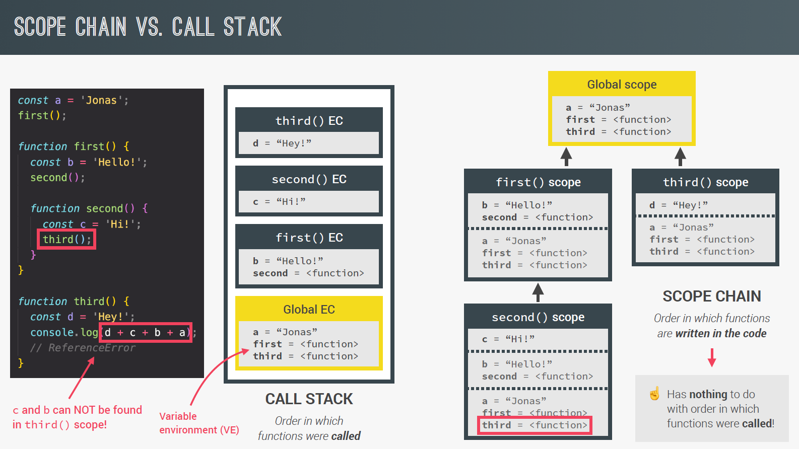

## Javascript Definition

- **JavaScript** is a high-level, prototype-based, object-oriented, multi-paradigm, interpreted or just-in-time compiled, dynamic, single-threaded, garbage-collected programming language with first-class functions and a non-blocking event loop concurrency model.
- **High Level Language** - JavaScript abstracts away most of the complex details of the computer (like memory management or CPU registers), making it easier for humans to read and write.
- **Garbage-collected** - Memory management is handled automatically—JavaScript detects and frees memory that is no longer used.
- A **compiler** translates the entire source code into machine code (binary) before execution. It produces an executable file (like `.exe`), Compilation results in faster execution. Eg: C, C++

  An **interpreter** executes code line by line, at runtime—it doesn’t create a separate machine code file. Slower execution (because it reads code as it runs). Eg: Python, Java

  **JIT (Just-In-Time Compilation)** compiles code at runtime, not ahead of time. It translates parts of the program into machine code just before they're needed, then executes that machine code.

  How JIT works -

  1. You write your code in a high-level language (e.g., JavaScript).
  2. Instead of compiling everything before running, the interpreter starts running your code line-by-line.
  3. The JIT compiler notices frequently used ("hot") code
  4. It compiles those hot parts into machine code on the fly.
  5. Next time, that machine code runs directly, much faster than interpreting.

  Javascript is often interpreted, but modern engines JIT compile parts of it for speed.

## JS Engine

- Javascript Engine is a program that executes Javascript code.
- Each browser has its own JavaScript engine. For example - **V8 Engine** in Google Chrome; **Spider Monkey** in Mozilla.
- **NodeJS** is a non-browser run-time environment for Javascript, which helps us to build backend application with Javascript. It uses V8 Engine.
- A JS engine will have - **Call Stack** and **Heap**.
- **Call Stack**: It contains **Execution Contexts** where JS code is executed.
- **Heap**: Heap is a region in memory where objects, functions, and closures are stored.

## SCOPE

- **Scoping**: How our program’s variables are organized and accessed. “Where do variables
  live?” or “Where can we access a certain variable, and where not?”
- JS has **Lexical Scoping** - Scoping is controlled by placement of functions and blocks in the code.
- **Scope**: Space or environment in which a certain variable is declared (variable environment in case of functions). There is global scope, function scope, and block scope
- **Scope of a variable**: Region of our code where a certain variable can be accessed.
- **Global Scope**: Variables declared outside any function or block are in the global scope and are accessible anywhere in your code.

  ```js
  let globalVar = "I'm global!";

  function show() {
    console.log(globalVar); // ✅ Accessible
  }

  show();
  console.log(globalVar); // ✅ Accessible
  ```

- **Function Scope**: Variables declared inside a function using var, let, or const are only accessible within that function.

  ```js
  function testScope() {
    var a = 1;
    let b = 2;
    const c = 3;

    console.log("Inside function:");
    console.log("var a:", a); // ✅ 1
    console.log("let b:", b); // ✅ 2
    console.log("const c:", c); // ✅ 3
  }

  testScope();

  console.log("Outside function:");
  console.log("var a:", a); // ❌ ReferenceError: a is not defined
  console.log("let b:", b); // ❌ ReferenceError: b is not defined
  console.log("const c:", c); // ❌ ReferenceError: c is not defined
  ```

- **Block Scope**: Variables declared with let or const inside curly braces {} (such as in if, for, or {} blocks) are block-scoped—accessible only inside that block.

  ```js
  if (true) {
    let x = 10;
    const y = 20;
    var z = 30;
    console.log(x, y, z); // ✅ All accessible here
  }

  console.log(z); // ✅ var is function/global scoped
  console.log(x); // ❌ ReferenceError
  console.log(y); // ❌ ReferenceError
  ```

- 
- 

## Hoisting

- Hoisting Makes some types of variables accessible/usable in the code before they are actually declared. “Variables lifted to the top of their scope”.
- Only declarations are hoisted, not initializations.
- Key points -

  | Keyword/Type         | Hoisted              | Initialized       | Access Before Declaration                    |
  | -------------------- | -------------------- | ----------------- | -------------------------------------------- |
  | `var`                | ✅ Yes               | ✅ As `undefined` | ✅ Allowed, but returns `undefined`          |
  | `let`                | ✅ Yes               | ❌ No             | ❌ ReferenceError (Temporal Dead Zone)       |
  | `const`              | ✅ Yes               | ❌ No             | ❌ ReferenceError (Temporal Dead Zone)       |
  | Function Declaration | ✅ Yes               | ✅ Yes            | ✅ Fully accessible                          |
  | Function Expression  | ✅ (only `var` part) | ❌ No             | ❌ TypeError (`undefined is not a function`) |

- **TDZ**, or **Temporal Dead Zone**, is the period between: when a let or const variable is hoisted, and when it is actually declared (initialized) in your code.
  During this time, any attempt to access the variable will result in a ReferenceError.
- The Temporal Dead Zone helps avoid bugs and encourages cleaner code by:
  1. Preventing the use of variables before they are safely initialized.
  2. Enforcing block-scoping rules for let and const.

## `window` Object in Js

- In JavaScript, especially in browser environments, the `window` object is a global object that represents the browser window or tab. It acts as the top-level object for all JavaScript code running in the browser.
- It is automatically available in the browser (no need to declare or import).
- It represents the global scope.
- All global variables, functions, and browser APIs (like alert(), setTimeout(), document, etc.) are properties or methods of the window object.
- Global variables declared with `var` become properties of window. But `let` and `const` do not.

  ```js
  var x = 10;
  console.log(window.x); // ✅ 10 (for var in global scope)

  function greet() {
    console.log("Hello!");
  }

  window.greet(); // ✅ "Hello!"
  ```

- In Node.js, there is no window object, because it's not running in a browser. Node uses `global` as the global object.

## `this` Keyword

- `this` keyword/variable: Special variable that is created for every execution context (every function).
  Takes the value of (points to) the “owner” of the function in which the this keyword is used.
- Its value depends on how a function is called, not where it’s defined.

  | Situation                          | What `this` refers to                                         |
  | ---------------------------------- | ------------------------------------------------------------- |
  | In global scope (browser)          | `window` (global object)                                      |
  | Inside a regular function          | `window` (in non-strict mode) or `undefined` (in strict mode) |
  | Inside a method (object function)  | The object that owns the method                               |
  | In an event handler (`el.onclick`) | The DOM element that triggered the event                      |
  | In an arrow function               | `this` is **lexically bound** (inherits from the outer scope) |
  | With `call`, `apply`, or `bind`    | You **manually specify** what `this` should be                |
  | In class constructors/methods      | The instance of the class                                     |

- When we try to access a variable in the global scope, which is not defined, it will not throw an error, it will consider the variable to be `undefined`

## `arguments` Keyword in Function

- The **arguments** keyword is an array-like object available inside regular functions, representing all the arguments passed to that function, regardless of how many parameters are declared.
- It is only available in regular (non-arrow) functions.
- It contains all passed arguments (even extra ones).
- It is not a real array, but can be converted to one using `Array.from()` or spread syntax ([...arguments]).

  ```js
  function sum() {
    console.log(arguments);
    let total = 0;
    for (let i = 0; i < arguments.length; i++) {
      total += arguments[i];
    }
    return total;
  }

  console.log(sum(2, 4, 6)); // Output: 12
  ```

  ```js
  const showArgs = () => {
    console.log(arguments); // ❌ ReferenceError
  };

  showArgs(1, 2, 3);
  ```

  ```js
  function printArgs() {
    const argsArray = Array.from(arguments);
    console.log(argsArray);
  }
  printArgs("a", "b", "c"); // ['a', 'b', 'c']
  ```

  ```js
  function example1() {
    console.log(arguments); // works
  }

  const example2 = (...args) => {
    console.log(args); // preferred in modern JS
  };
  ```
