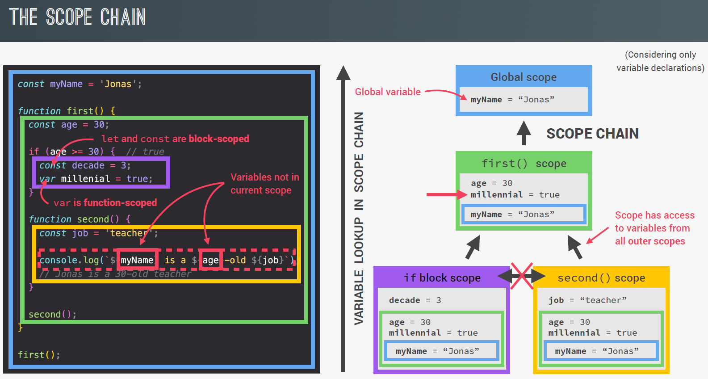

## Javascript Definition

- **JavaScript** is a high-level, prototype-based, object-oriented, multi-paradigm, interpreted or just-in-time compiled, dynamic, single-threaded, garbage-collected programming language with first-class functions and a non-blocking event loop concurrency model.
- **High Level Language** - JavaScript abstracts away most of the complex details of the computer (like memory management or CPU registers), making it easier for humans to read and write.
- **Garbage-collected** - Memory management is handled automatically—JavaScript detects and frees memory that is no longer used.
- A **compiler** translates the entire source code into machine code (binary) before execution. It produces an executable file (like `.exe`), Compilation results in faster execution. Eg: C, C++

  An **interpreter** executes code line by line, at runtime—it doesn’t create a separate machine code file. Slower execution (because it reads code as it runs). Eg: Python, Java

  **JIT (Just-In-Time Compilation)** compiles code at runtime, not ahead of time. It translates parts of the program into machine code just before they're needed, then executes that machine code.

  How JIT works -

  1. You write your code in a high-level language (e.g., JavaScript).
  2. Instead of compiling everything before running, the interpreter starts running your code line-by-line.
  3. The JIT compiler notices frequently used ("hot") code
  4. It compiles those hot parts into machine code on the fly.
  5. Next time, that machine code runs directly, much faster than interpreting.

  Javascript is often interpreted, but modern engines JIT compile parts of it for speed.

## JS Engine

- Javascript Engine is a program that executes Javascript code.
- Each browser has its own JavaScript engine. For example - **V8 Engine** in Google Chrome; **Spider Monkey** in Mozilla.
- **NodeJS** is a non-browser run-time environment for Javascript, which helps us to build backend application with Javascript. It uses V8 Engine.
- A JS engine will have - **Call Stack** and **Heap**.
- **Call Stack**: It contains **Execution Contexts** where JS code is executed.
- **Heap**: Heap is a region in memory where objects, functions, and closures are stored.

## SCOPE

- **Scoping**: How our program’s variables are organized and accessed. “Where do variables
  live?” or “Where can we access a certain variable, and where not?”
- JS has **Lexical Scoping** - Scoping is controlled by placement of functions and blocks in the code.
- **Scope**: Space or environment in which a certain variable is declared (variable environment in case of functions). There is global scope, function scope, and block scope
- **Scope of a variable**: Region of our code where a certain variable can be accessed.
- **Global Scope\***: Variables declared outside any function or block are in the global scope and are accessible anywhere in your code.

  ```js
  let globalVar = "I'm global!";

  function show() {
    console.log(globalVar); // ✅ Accessible
  }

  show();
  console.log(globalVar); // ✅ Accessible
  ```

- **Function Scope**: Variables declared inside a function using var, let, or const are only accessible within that function.

  ```js
  function testScope() {
    var a = 1;
    let b = 2;
    const c = 3;

    console.log("Inside function:");
    console.log("var a:", a); // ✅ 1
    console.log("let b:", b); // ✅ 2
    console.log("const c:", c); // ✅ 3
  }

  testScope();

  console.log("Outside function:");
  console.log("var a:", a); // ❌ ReferenceError: a is not defined
  console.log("let b:", b); // ❌ ReferenceError: b is not defined
  console.log("const c:", c); // ❌ ReferenceError: c is not defined
  ```

- **Block Scope**: Variables declared with let or const inside curly braces {} (such as in if, for, or {} blocks) are block-scoped—accessible only inside that block.

  ```js
  if (true) {
    let x = 10;
    const y = 20;
    var z = 30;
    console.log(x, y, z); // ✅ All accessible here
  }

  console.log(z); // ✅ var is function/global scoped
  console.log(x); // ❌ ReferenceError
  console.log(y); // ❌ ReferenceError
  ```

- 
- 
